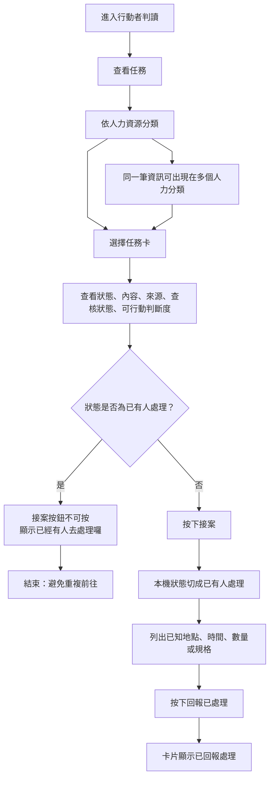

# 資訊流程設計

> 這份文件是 v1 流程設計草稿。流程合理性仍需要人類檢查；這不是正式派工規則，也不是救災判斷。

## 我的 v1 目標

- 我優先服務的使用者：行動者。
- 這個使用者最想完成的事：從原始資訊快速判斷自己下一步應該先確認什麼，避免重複前往或做白工。
- 我最想避免的錯誤：把未確認資訊、社群轉述或模糊地點誤看成可以直接前往的任務。

## 自然語言流程描述

```text
行動者先進入「查看任務」。
畫面依需要的人力資源分類，例如醫療、清泥人員、水電工、物資盤點或後勤人員、現場查核人員。
同一筆原始資訊可以出現在多個分類，不把分類結果當成正式派工。

行動者點開任務卡後，先看狀態、內容、來源、查核狀態與可行動判斷度。
如果狀態已經是「已有人處理，先不要去」，接案按鈕不可使用，避免重複前往。

如果行動者按下接案，這筆任務的本機狀態立即切成「已有人處理，先不要去」。
畫面列出原文中已知的地點、時間、數量或規格；不知道的資訊不硬補。

接案後，行動者可以按「回報已處理」。
這些接案與回報只存在本機示範，不代表正式派工、多人同步或真實完成。
```

## Mermaid 流程圖



## 固定線條示意

```text
[進入行動者判讀]
        |
[查看任務]
        |
[依人力資源分類]
        |
[選擇任務卡]
        |
[看狀態、內容、來源、查核狀態、可行動判斷度]
        |
{已有人處理？}
     / 是                         \ 否
[接案按鈕不可按]             [按下接案]
     |                            |
[避免重複前往]               [狀態切成已有人處理]
                                  |
                           [列出已知資訊]
                                  |
                           [回報已處理]
```

## 人工確認點

- 任務卡被分到哪些人力分類是否合理。
- 接案前是否已經有人處理，是否應避免重複前往。
- 接案後列出的地點、時間、數量或規格是否真的來自原文。
- 「回報已處理」是否只是本機示範，不應被誤解成正式完成。

## 不能自動處理的分支

- 來源是社群轉述、來電或第三方描述時，不能自動判定已確認。
- 地點、時間、數量、需求類型不清楚時，不能硬補在接案資訊中。
- 出現「不要再派」「不再收」「道路封閉」「不適合停留」等限制時，接案應被擋下。
- AI 不能自動決定是否真的缺人、缺物資、是否已有人處理或是否已完成。

## 操作或判斷紀錄

- 行動者切換狀態時，應記錄選擇前後狀態與來源。
- 行動者按下接案時，本機狀態會變成「已有人處理，先不要去」。
- 行動者按下「回報已處理」時，只代表本機示範完成，不代表真實任務完成。
- 若資訊缺地點、時間或數量，接案資訊中不要硬補。

## 我檢查後修正了什麼

- 原本：流程重點是單筆資訊的行動判讀。
- 修正後：流程改成「查看任務 → 依人力分類 → 接案 → 自動避免重複接案 → 回報已處理」。
- 為什麼：使用者想測試另一種更接近行動者工作台的版面，但仍需保留本機示範與未查核提醒。

## 我仍不確定的流程點

- 接案後是否需要記錄是誰接案、何時接案。
- 「回報已處理」是否需要補充處理結果或照片，但目前不能接真實外部資料。
- 同一筆資訊出現在多個分類時，是否需要顯示所有分類標籤。
