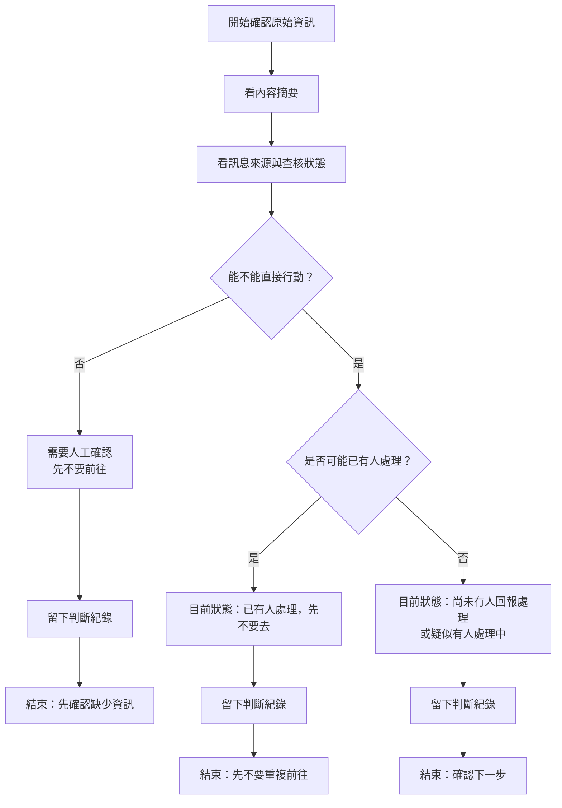

# 資訊流程設計

> 這份文件是 v1 流程設計草稿。流程合理性仍需要人類檢查；這不是正式派工規則，也不是救災判斷。

## 我的 v1 目標

- 我優先服務的使用者：行動者。
- 這個使用者最想完成的事：從原始資訊快速判斷自己下一步應該先確認什麼，避免重複前往或做白工。
- 我最想避免的錯誤：把未確認資訊、社群轉述或模糊地點誤看成可以直接前往的任務。

## 自然語言流程描述

```text
行動者從一筆原始資訊開始確認。
畫面先看內容摘要，再看訊息來源與查核狀態，不把原始資訊改寫成已確認事實。

行動者先看資訊是否有足夠的行動線索，例如需要的人員種類、明確數量或規格、可辨識地點、明確時間、處理者或現場角色。

如果線索不足，這筆資訊標示為需要人工確認，不能直接前往。
如果原文出現停止、限制、衝突或可能已有人處理，狀態改成「已有人處理，先不要去」。
如果資訊相對完整但仍未查核，狀態只能停在「尚未有人回報處理」或「疑似有人處理中」，並保留人工確認提醒。

每次行動者調整「目前狀態」或判斷不能直接行動，都應留下判斷紀錄，包含根據哪個來源、為什麼不能直接行動。
```

## Mermaid 流程圖



## 固定線條示意

```text
[開始確認原始資訊]
        |
[看內容摘要]
        |
[看訊息來源與查核狀態]
        |
{能不能直接行動？}
     / 否                         \ 是
[需要人工確認]              {是否可能已有人處理？}
     |                         / 是                    \ 否
[先不要前往]          [已有人處理，先不要去]   [尚未回報或疑似處理中]
     |                         |                        |
[留下判斷紀錄]          [留下判斷紀錄]          [留下判斷紀錄]
     |                         |                        |
[先確認缺少資訊]        [先不要重複前往]        [確認下一步]
```

## 人工確認點

- 資訊是否有足夠行動線索：人員種類、數量或規格、地點、時間、處理角色。
- 「疑似有人處理中」或「已有人處理，先不要去」是否符合現場實際狀況。
- 一筆資訊是否應標示為「需要人工確認，先不要前往」。

## 不能自動處理的分支

- 來源是社群轉述、來電或第三方描述時，不能自動判定已確認。
- 地點、時間、數量、需求類型不清楚時，不能自動轉成可前往任務。
- 出現「不要再派」「不再收」「道路封閉」「不適合停留」等限制時，不能自動建立新任務。
- AI 不能自動決定是否真的缺人、缺物資、是否已有人處理。

## 操作或判斷紀錄

- 行動者切換「目前狀態」時，應記錄選擇前後狀態與來源。
- 人工判斷「需要人工確認」或「先不要前往」時，應記錄理由。
- 若資訊被判定不能直接行動，應保留不能直接行動的原因，例如地點模糊、時間過期、來源未查核。

## 我檢查後修正了什麼

- 原本：流程後半段把「資訊完整」接到候選結果與候選下一步，太像任務管理流程。
- 修正後：流程縮短成「看來源與原文 → 判斷能不能直接行動 → 選目前狀態並留紀錄」，不建立任務或候選結果。
- 為什麼：v1 服務對象是行動者，流程應先回答「現在能不能動」，並避免 Codex 誤以為要實作派工系統。

## 我仍不確定的流程點

- 「疑似有人處理中」是否應該需要額外欄位記錄是誰回報、何時回報。
- 行動者切換狀態後，是否需要在 v1 prototype 中顯示「這只是本機示範狀態」的更強提醒。
- 「需要人工確認，先不要前往」是否要成為最醒目的第一層狀態。
